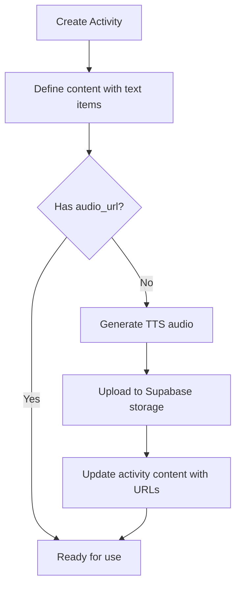

# Voice Tutorial Generation Skill

This skill guides you through creating voice-guided content and audio files for the MYLearnt educational platform.

## Voice System Architecture

The platform has a two-layer voice system:

### Layer 1: AI Tutor (Optional)
- Generates educational explanations based on content type
- Uses Gemini 3 Flash for text generation
- Creates contextual tutoring dialogue

### Layer 2: Text-to-Speech
- Converts text to natural speech
- Uses Gemini 2.5 Flash TTS
- Supports multiple voices per language

## Voice Configuration

### Language-Voice Mapping
| Locale | Primary Voice | Fallback Voices | Use Case |
|--------|--------------|-----------------|----------|
| ms (Malay) | Kore | Aoede, Zephyr | BM subjects, suku kata |
| zh (Chinese) | Puck | Zephyr, Charon | BC subjects, hanzi |
| en (English) | Kore | Zephyr, Charon | EN subjects |

### Available Voices
- `Kore` - Clear, friendly (default for ms/en)
- `Puck` - Warm, expressive (default for zh)
- `Aoede` - Soft, gentle
- `Zephyr` - Neutral, professional
- `Charon` - Deep, authoritative
- `Leda` - Bright, youthful
- `Orus` - Calm, measured
- `Fenrir` - Strong, confident

## Content Types

The AI tutor generates different content based on type:

### 1. letter
For alphabet learning.
```
Input: "A"
Output (ms): "Huruf A. Terus terangkan: sebut nama huruf, bunyinya,
dan satu contoh perkataan yang bermula dengan A seperti Ayam."
```

### 2. syllable
For suku kata (Malay syllables).
```
Input: "ba"
Output (ms): "Suku kata 'ba'. Terdiri daripada konsonan 'b' dan vokal 'a'.
Cuba sebut bersama saya: ba... ba... ba"
```

### 3. word
For vocabulary learning.
```
Input: "baju"
Output (ms): "Perkataan 'baju'. Baju bermaksud pakaian yang kita pakai.
Mari sebut: ba-ju, baju."
```

### 4. sentence
For speaking practice.
```
Input: "Selamat pagi"
Output (ms): "Ayat ini ialah 'Selamat pagi'. Kita guna untuk memberi salam
pada waktu pagi. Sebut dengan saya: Selamat pagi."
```

### 5. instruction
For activity directions.
```
Input: "Padankan huruf dengan gambar"
Output: Direct TTS without AI processing
```

### 6. feedback
For encouragement and correction.
```
Input: "Betul! Bagus!"
Output: Direct TTS with enthusiastic tone
```

## API Endpoints

### Direct TTS
**File**: `src/app/api/tts/route.ts`

```typescript
// Request
POST /api/tts
{
  text: "Selamat pagi",
  locale: "ms"  // ms | zh | en
}

// Response
{
  audio: "base64_encoded_audio_data",
  mimeType: "audio/mp3"
}
```

### AI Voice Tutor
**File**: `src/app/api/voice-tutor/route.ts`

```typescript
// Request
POST /api/voice-tutor
{
  content: "ba",
  contentType: "syllable",  // letter | syllable | word | sentence | instruction | feedback
  context: "Suku Kata Unit 2",  // Optional activity context
  locale: "ms",  // ms | zh | en
  directTTS: false  // Skip AI, use content directly
}

// Response
{
  audio: "base64_encoded_audio_data",
  mimeType: "audio/mp3",
  text: "Generated tutoring text that was spoken"
}
```

### Batch Audio Generation
**File**: `src/app/api/generate-audio/route.ts`

```typescript
// Request
POST /api/generate-audio
{
  startIndex: 0,
  count: 5  // Generate 5 audio clips
}

// Response
{
  success: boolean,
  generated: number,
  results: [
    { activityId: string, index: number, audioUrl: string, success: boolean }
  ],
  nextIndex: number
}
```

## Generating Audio for Activities

### Step 1: Identify Content Needing Audio

Activities with these types need audio:
- `speaking` - `phrases[].text`
- `syllable` - `syllables[]` and `words[].word`
- `dictation` - `words[].word`

### Step 2: Generate Audio Clips

**Option A: Use Batch API**
```bash
# Generate first 10 audio clips
curl -X POST /api/generate-audio -d '{"startIndex": 0, "count": 10}'
```

**Option B: Manual Generation**
```typescript
// For each item needing audio
const response = await fetch('/api/tts', {
  method: 'POST',
  body: JSON.stringify({
    text: 'baju',
    locale: 'ms'
  })
});
const { audio, mimeType } = await response.json();
// Upload to storage...
```

### Step 3: Upload to Supabase Storage

```typescript
// Upload pattern
const path = `audio/${activityType}/${activityId}/${index}.mp3`;
await supabase.storage.from('audio').upload(path, audioBuffer);
```

### Step 4: Update Activity Content

```sql
-- Update syllable activity with audio URLs
UPDATE activities
SET content = jsonb_set(
  content,
  '{data,audio_urls}',
  '["audio/syllable/abc123/0.mp3", "audio/syllable/abc123/1.mp3"]'
)
WHERE id = '{activity_id}';
```

## Storage Structure

```
supabase-storage/
└── audio/
    ├── speaking/
    │   └── {activity_id}/
    │       ├── 0.mp3
    │       ├── 1.mp3
    │       └── ...
    ├── syllable/
    │   └── {activity_id}/
    │       ├── 0.mp3  (syllable audio)
    │       └── ...
    └── dictation/
        └── {activity_id}/
            └── ...
```

## Client-Side Usage

### VoiceTutorButton Component
```tsx
<VoiceTutorButton
  text="ba"
  locale="ms"
  size="md"
  contentType="syllable"
  audioUrl={preGeneratedUrl}  // Optional: skip API call
/>
```

### useVoiceTutor Hook
```typescript
const { speak, speakDirect, isLoading, isSpeaking } = useVoiceTutor({
  locale: 'ms'
});

// AI-generated tutoring
await speak('ba', { contentType: 'syllable' });

// Direct TTS
await speakDirect('Selamat pagi');
```

## AI Tutor Prompt Templates

### Malay (ms)
```javascript
const prompts = {
  letter: `Huruf ${content}. Terus terangkan: sebut nama huruf, bunyinya,
    dan satu contoh perkataan yang bermula dengan huruf ini.`,
  syllable: `Suku kata '${content}'. Terus terangkan: pecahkan kepada
    konsonan dan vokal, dan akhiri dengan "Cuba sebut bersama saya:
    ${content}... ${content}... ${content}"`,
  word: `Perkataan '${content}'. Terus terangkan: sebut perkataan dan
    maksudnya dalam 1-2 ayat yang mudah difahami kanak-kanak.`
};
```

### Chinese (zh)
```javascript
const prompts = {
  letter: `字母 ${content}。直接解释：发音和一个以这个字母开头的例子词。`,
  word: `词语'${content}'。直接解释：发音和简单的意思，用1-2句话。`,
  sentence: `句子'${content}'。直接解释：意思和在什么情况下使用。`
};
```

### English (en)
```javascript
const prompts = {
  letter: `The letter ${content}. Explain: say the letter name, its sound,
    and give one example word starting with this letter.`,
  word: `The word '${content}'. Explain: pronunciation and meaning in
    1-2 simple sentences suitable for children.`
};
```

## Best Practices

1. **Pre-generate Audio**: For production, pre-generate all audio to avoid API latency
2. **Rate Limiting**: Add 2-second delays between batch API calls
3. **Fallback Handling**: Always have TTS fallback if AI generation fails
4. **Cache Audio**: Client-side caching prevents repeated API calls
5. **Language Consistency**: Match audio language to subject content, not UI locale

## Workflow: Adding Voice to New Activity



## Troubleshooting

### No Audio Generated
- Check API key configuration for Gemini
- Verify locale is valid (ms, zh, en)
- Check Supabase storage permissions

### Wrong Language Voice
- Ensure `locale` parameter matches content language
- Subject content should use subject language, not UI locale

### Audio Quality Issues
- Use PCM format for best quality
- 24kHz sample rate recommended
- Convert to MP3 for storage/delivery

## Related Skills

- **course-syllabus**: Create activities that need voice content
- **image-generation**: Generate visual aids to accompany audio
